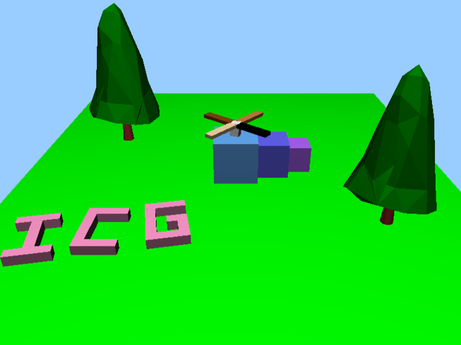
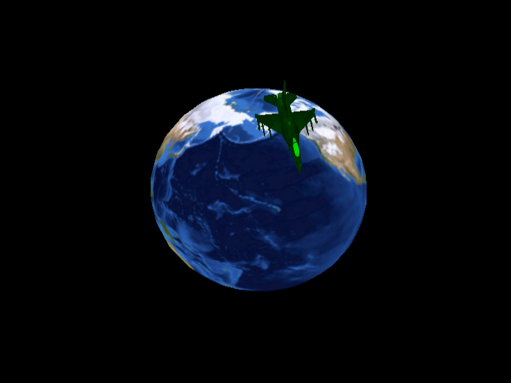
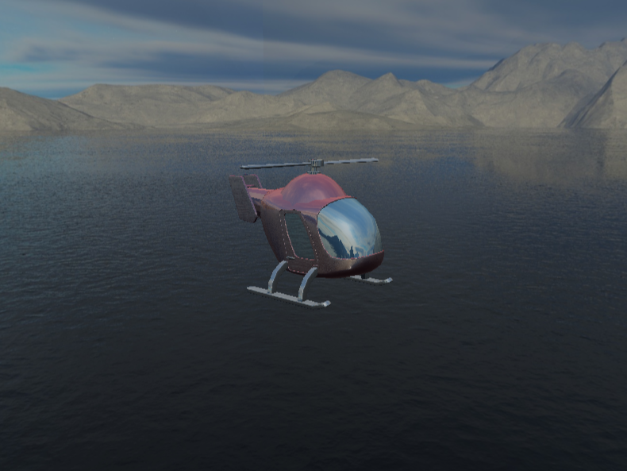
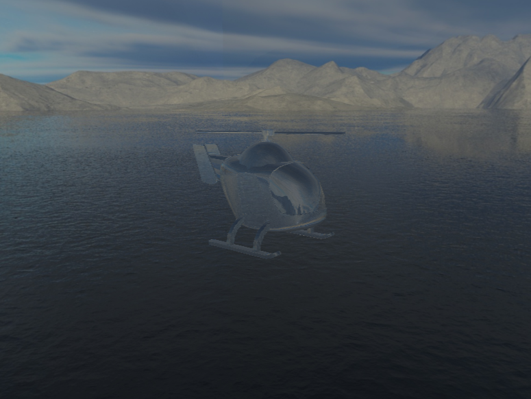
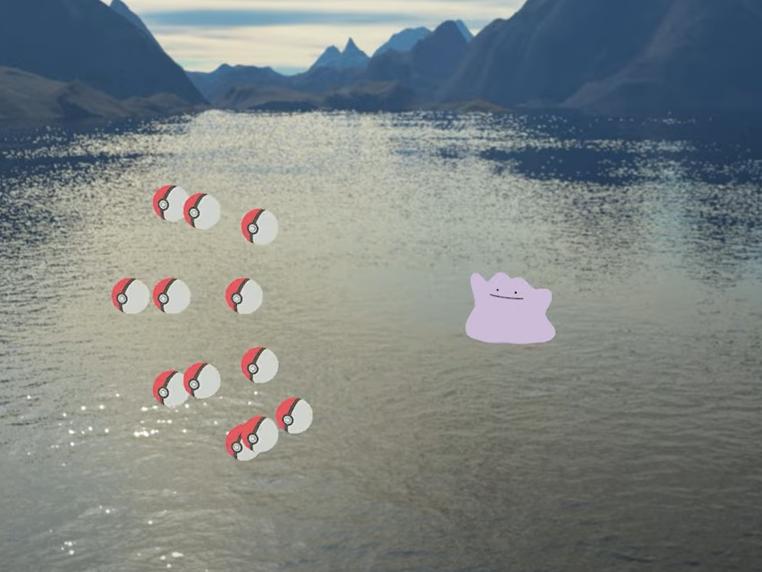
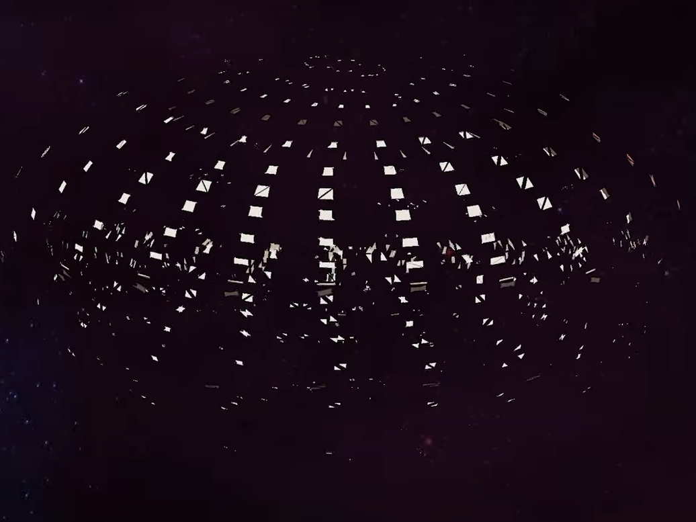

# Intro. to Computer Graphics, 2024 Fall @ NYCU
Lecturer: 林

## HW1

  

  

## HW2: OpenGL Shaders and GLSL

  
  &nbsp;
  

## HW3: Vertex and Fragment Shaders

  
  &nbsp;
  

## HW4: Geometry Shader and Final Project

  
  &nbsp;
  

